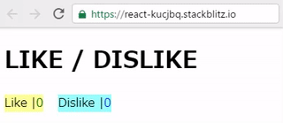

# LIKE/DISLIKEボタン
Web上でLIKE/DISLIKEするボタンコンポーネント

## 仕様
* LIKE/DISLIKEを押すとカウントが1増えます.

* LIKE/DISLIKEがされた状態でもう一度同じボタンを押すとカウントが減ります.

* LIKE/DISLIKEされた状態で反対のDILIKE/LIKEを押すと状態が入れ替わります.

## 動作環境
[StackBlitz](https://stackblitz.com/ "StackBlitz")のReactで動きます.

## サンプル

